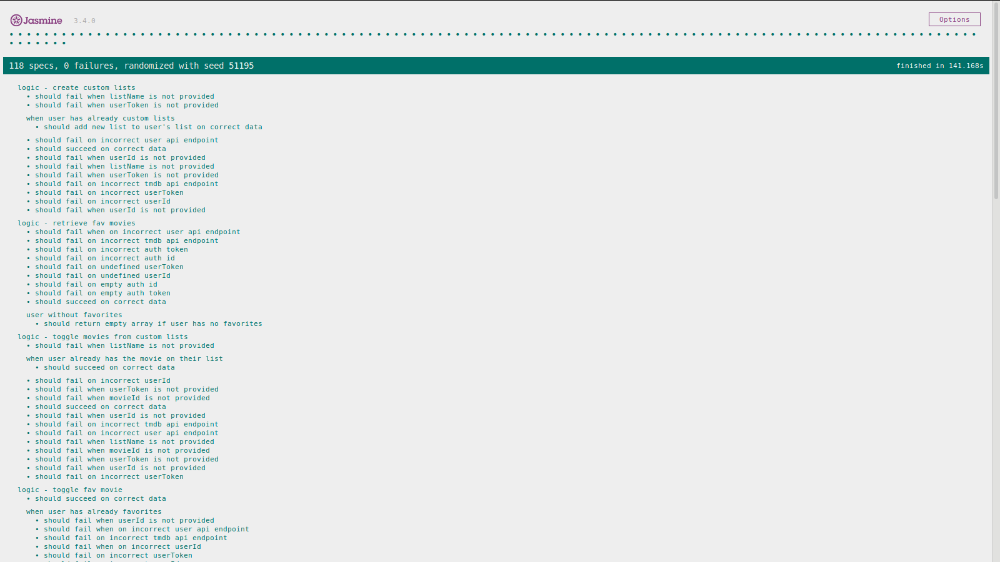

# MOVIE-LAB

## Introduction:

Movie-Lab is a [SPA](https://en.wikipedia.org/wiki/Single-page_application).

This app allows searches through the [The Movie DB](https://www.themoviedb.org/). 
You could search movies by key words an by genre throw different collections. 
After the search, you could see the details of all movies listed and add to favorites and to a customized lists.

The app is developed with [React](https://reactjs.org). The layout has been done with SASS. 

## Functional Description

### Use Cases

### Activity Diagram

## Technical Description:

### Blocks

### Components

### Data Model

### Code Coverage

